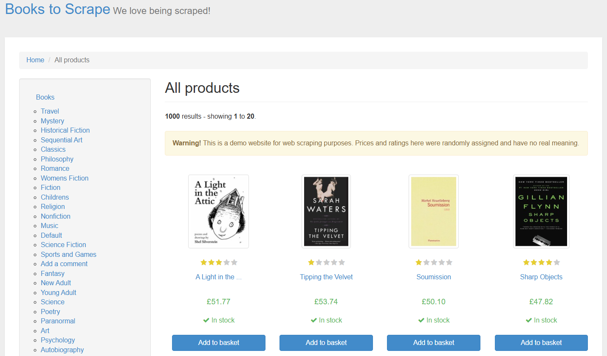
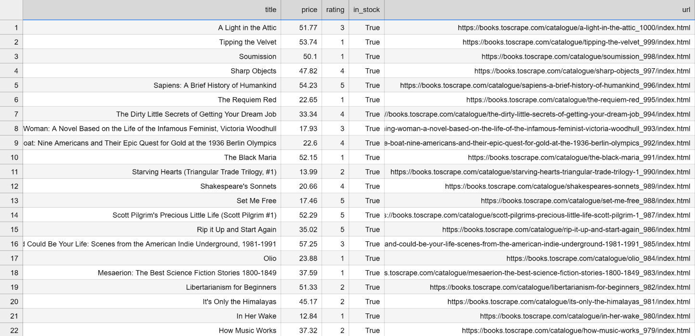

# 📚 Books Scraper & Data Analytics 

Python web scraper designed to collect product details from [Books to Scrape](http://books.toscrape.com) using **BeautifulSoup**, process and clean the extracted data using **pandas**, export it to a structured CSV file, and perform SQL analytical queries.


---

## 📁 Project Structure

```text
books-scraper/
├── main.py          # Main Python script for scraping & data cleaning
├── books.csv        # Extracted dataset containing 100 books
├── queries.sql      # SQL analytical queries
└── README.md        # Project documentation
```
---
## 🚀 Features

* Web Scraping: Extracts data across 5 pages (100 books total) using requests and BeautifulSoup.

* Data Cleaning & Pipeline: Normalizes ratings to numeric values, converts stock availability into boolean flags, handles absolute URL building, and cleans raw currency symbols.

* Pandas Data Processing: Structures extracted items into a clean DataFrame and exports them seamlessly to CSV format.


* SQL Analytics: Runs SQL queries to perform business logic aggregations on the dataset.

---
## 📦 Prerequisites & Dependencies

Make sure you have **Python 3.8+** installed along with the required libraries:

- `requests`
- `beautifulsoup4`
- `pandas`

To install all dependencies, run:

```bash
pip install requests beautifulsoup4 pandas
```
---
## 📊 SQL Analytics Summary (`queries.sql`)

The `queries.sql` file contains structured SQL queries designed to analyze the scraped book dataset and answer key business questions:

1. **Average Price by Rating:**  
   Calculates the average book price for each rating tier (1 to 5 stars) to identify pricing patterns across different ratings.

2. **Top High-Rated Books:**  
   Retrieves the top 5 most expensive books that have a high rating (4 or 5 stars) using conditional filtering and ordering.

3. **Out-of-Stock Count per Rating:**  
   Aggregates and counts the number of out-of-stock books categorized by their rating tier to evaluate inventory availability.

---
## 📝 Reflection & Challenges (Five Lines)

Below are the 5 reflective statements addressing the assessment requirements regarding development bottlenecks and rate-limiting handling:

1. Handling pagination was straightforward logically, but finding the cleanest, most readable way to structure the loop took more time than expected.
2. I prioritized code clarity to ensure the script remains easy to maintain without over-complicating page transitions.
3. If rate-limited after 50 requests, I would add random delays (`time.sleep`) between requests to avoid triggering server thresholds.
4. Additionally, I would rotate `User-Agent` headers across requests to mimic natural browser behavior.
5. These techniques ensure smooth data collection while adhering to web scraping best practices.

---
## 👤 Author

**Esraa Ashraf**
